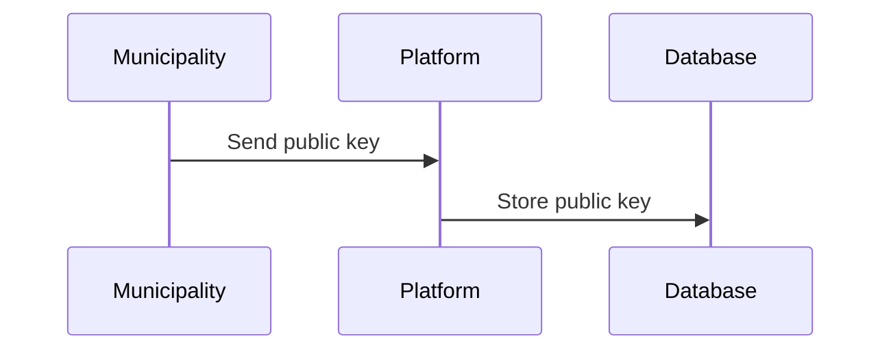
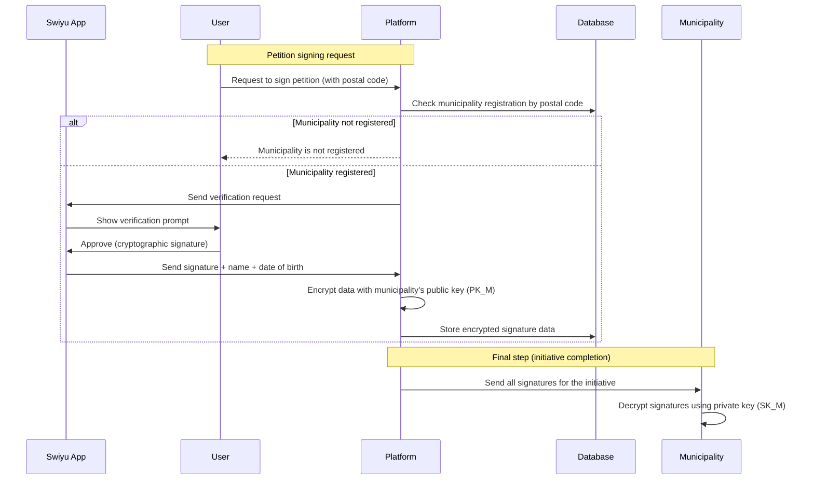

# 12) Federated e-collection framework that respects cantons sovereignty while giving citizens a seamless and privacy first experience.

## https://e-initiative.ch/

## Approach

A **federated, user-centered e-collecting system** where each municipality keeps full sovereignty over its own validation process.
Citizens experience a unified and simple, privacy-first interface; municipalities retain operational independence.

The platform encrypts personal information with keys provided by the municipalities. This way, this sensitive data is only ever readable by the municipality that needs it.
Validation pathways adapt to local capabilities for evolution or changes.

## Documentation and Diagrams

### Registering New Municipalities

### Signing a petition

## Topics addressed

| Topic                                       | (How) is it addressed?                                                                                                             |
| --------------------------------------------- | ------------------------------------------------------------------------------------------------------------------------------------ |
| 1:  From willingness to signature           | Unified, secure user flow — e-ID login and encrypted communication & data storage.                                                |
| 2:  Access to collected signatures          | Personal information can only be decrypted by the municipality that needs them.                                                    |
| 3:  Attribution to committees               | Referral code for each collecting party.                                                                                           |
| 4:  Information on e-collecting projects    | The tool-administrator approves the content of the initiative. Registration for newsletters is not the responsibility of the tool. |
| 5:  Exclusion of invalid signatures         | Validation through e-ID.                                                                                                           |
| 6:  Prevention of lost or hidden signatures | Is in the responsibility of the municipality. Referral codes allows committees to check the numbers.                               |
| 7:  Protection of voting secrecy            | Only the municipality has access on this information.                                                                              |
| 8:  Integration with paper process          | CVS export to integrate in existing systems, openness to adapting APIs.                                                            |
| 9:  Easy adoption for municipalities        | User friendly - download functionality (CSV, PDF).                                                                                 |
| 10:  Applicable to all federal levels       | Cantonal and federal Initiative are supported, Municipal ones can be added.                                                        |

## Key Strenghts and Weaknesses

### Strengths:

- **Federated and sovereign:** Each municipality keeps control of its own validation processes.
- **User-focused:** Clear and simple experience for all citizens and municipalities.
- **Privacy-first:** All personal information is stored encrypted and only decryptable by the municipality that needs it.
- **Easy to integrate:** Can be used by the municipalities who are registered without much change to existing processes.

### Weaknesses and Mitigations:

- No validation if municipalities actually received and processed signatures.
  → *Mitigation:* Refinement of the cryptographic protocols.

## Getting Started

first demo available at [https://e-initiative.ch/](https://e-initiative.ch/)

## Team Members

- SAN / @P6g9YHK6
- Yannick Rüfenacht / @yruefenacht
- Alfa Diop-Wicki / AlfaDiop-Wicki
- Lionel Stürmer / @lionelsemion

# Changelog

## 01.11.25
- Added RSA encryption for data security.
  - Private keys distributed to communes.
  - Pub key assigned in organisation section.
- Introduced an additional signing method.
- Split organisations and communes into distinct entities.
- Secured auditing contexts based on given rsa key.
- Added referral codes to all users for collection attribution.
- Numerous UI refinements and small tweaks.

## 03.11.25
- Moved demo encryption handling to browser level:
  - Public key sent to browser.
  - Public key displayed during signing.
- Allowed empty keys for audit/export demo. (will probably be back to this to add random placeholder stuff)
- Provided graph's data as tables for screen reader compatibility.
- Implemented a guided tour for each page.
- Updated status notices to reflect progress a little more accurately.
- Added HTML captions for accessibility.
- Extended approval process to include all initiative detail changes (not just publication).
- Visually separated communes, committees, and admin orgs in the org panel.
- Fixed initiative editor bugs.
- Implemented cleaner split of signing options per commune for context-specific configurations, now the process start with either asking for what commune to show supported option per commune or paper path.
- Added support for Municipal Initiatives.

## 12.11.25
- Moved language selector to first-visit setup, removing default language.
- Completed extensive UI tweaks.
- Created a public key registry page for transparency.
- Added transparency report to each initiative page (public and searchable).
- Exposed public changelog for initiatives.
- Now when signing a token is given as proof of signature and is verifiable against transparency report. (QR is also generated)

## 13.11.25
- improved backend to have fully automated recompile on changes.
  
## 05.12.25
- Added a transition after providing the private key in the auditing context.
- Optimized backend data processing to improve site performance.
- Removed signatures export from the initiative page; consolidated all signatures actions under the Audit tab.
- Fixed private key field in auditing.
- Obfuscated the key when populating the auditing context.
- Added optional SMS validation for communes requiring ID card verification.(exemple with post code 3000)
- Fixed broken icons.
- Added auditing features to the Export, Import, and Consultation tabs; improved overall audit workflow.
- Various UI optimizations.

## 09.12.25
- Properly linked backend organisation data to front-end via post-code maping
- Couple of ui fixes
- Added application reset button
- Added version number
  
## 24.12.25 

- Introduced a new workflow to officially refuse an initiative while keeping it available for viewing, including a clear explanation.
  
- Synced the system with the BFS registry of communes; the list is now fully complete.
  
- Removed postcode references across most of the application; BFS ID is now the primary internal reference.
- Improved the signature flow
- Deleted all previous commune data and migrated fully to the new synced database.
- Bunches of tweaks and corrections to the UI

# TODO
- Grouping features between communes to allow single management for multiples communes
- Improve the graphs to allow zoom and move
- now that filters are saved add button to reset filters to avoid un-intuitive behavior 
- build the private key management framework
- new framework to add data on top of the OFS Layer
- Implement demo e-id infra
- Rework the initiative editor to be more intuitive
- Enable URL linking support throughout the app (currently single URL page navigation).
- Allow commune to save private key in app if wanted, separated vault for automated key exchange?

