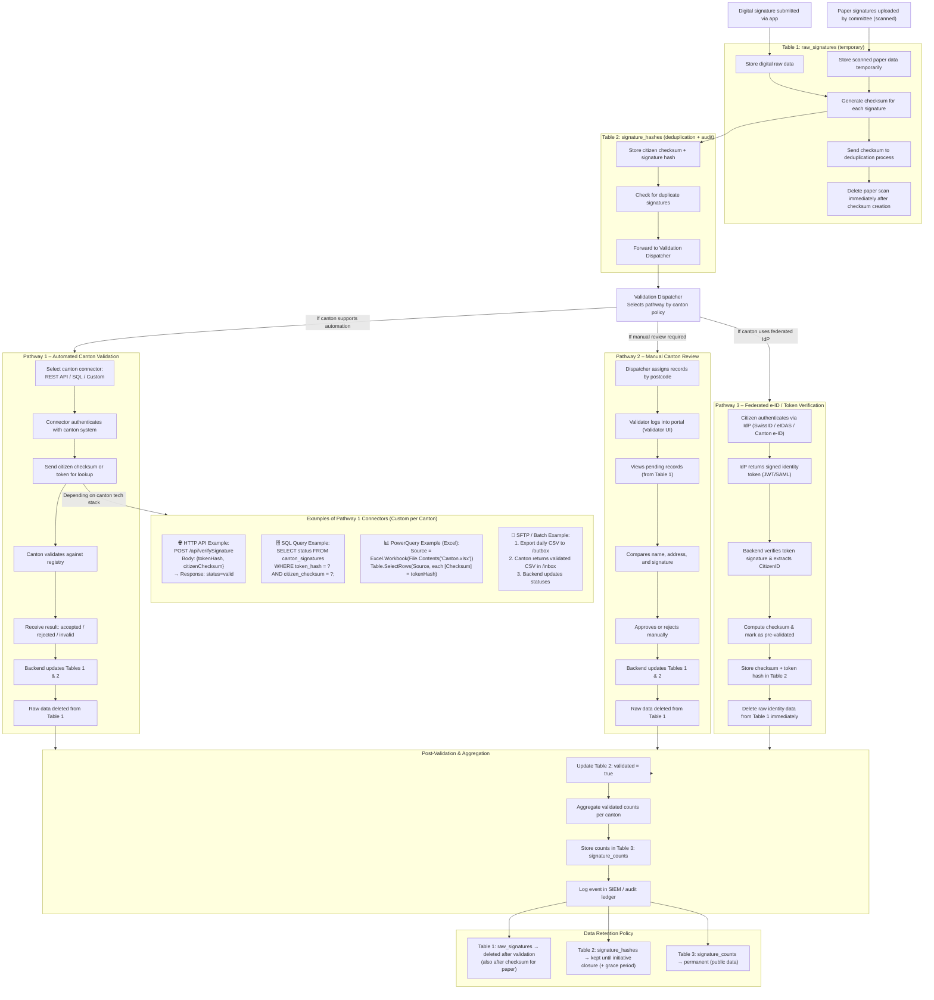

# 12) Federated e-collection framework that respects cantons sovereignty while giving citizens a seamless and privacy first experience.
## https://e-initiative.ch/

## Approach

A **federated, user-centered e-collecting system** where each canton keeps full sovereignty over its own validation process.
The platform connects **distributed** canton systems through standardized checksum exchanges, not centralized data.
Validation pathways adapt to local capabilities for evolution or changes.
Citizens experience a unified, privacy-first interface; cantons retain operational independence.

## Team needed:
- Canton and communes validation experiance
- Canton IT interoperability expertise 
- Data Security / cryptography
- Backend/API integration
- Frontend
- dev-ops
- e-id implementation


## Documentation and Diagrams


### Flowchart:

#### Data Flow:



#### Users Experiances flow:

*A step-by-step illustration showing how data and requests are exchanged between actors (customer, delivery site, restaurant, infrastructure), and key software components in the order process.*

```mermaid
TBD
```

## Topics addressed

*Explain how you addressed the topics presented in the [guidelines](https://www.bk.admin.ch/bk/de/home/politische-rechte/e-collecting/aktuelles.html), filling in the template below.*


| Topic | (How) is it addressed? |
| ------- | ------------------------ |
| 1     |                        |
| 2     |                        |
| 3     |                        |
| ...   |                        |

## Key Strenghts and Weaknesses

### Strengths:

- **Federated and sovereign:** Each canton keeps control of its own validation process.
- **User-focused:** Clear and simple experience for citizens across all cantons.
- **Privacy-first:** Only anonymized checksums are exchanged and kept after validation; personal data is never centralized.
- **Flexible setup:** Works with canton systems via API, SQL, PowerQuery, or e-ID.
- **Adaptable:** Can grow or simplify depending on each canton’s setup.

### Weaknesses and Mitigations:

- **Coordination needed:** Different canton systems mean extra setup and communication.
  → *Mitigation:* Use shared connector templates and a clear onboarding process.
- **Integration work:** Some cantons will need custom or manual tools.
  → *Mitigation:* Offer open-source connectors and optional tech support.
- **Manual delays:** Validation can take longer in some cantons.
  → *Mitigation:* Add alerts and support tools to notify and assist departments when manual validation is late


## Getting Started

first demo available at [https://e-initiative.ch/](https://e-initiative.ch/)


## Team Members

- SAN / @P6g9YHK6
- Yannick Rüfenacht / @yruefenacht 
- Alfa Diop-Wicki / AlfaDiop-Wicki
- Lionel Stürmer

- ...
